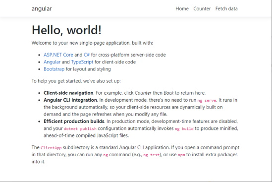
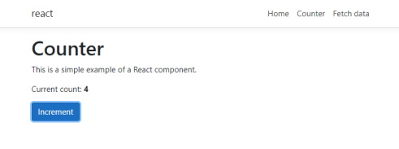
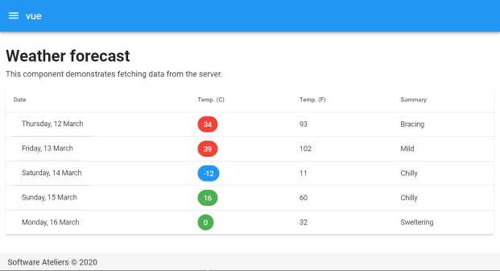

# hello.netcore-spa

Comparing dotnet core 3+ fullstack/spa options

- [Angular](https://angular.io/)
- [React](https://reactjs.org/)
- [Vue](https://vuejs.org/)
- [Aurelia](https://angular.io/)
- [Svelte](https://svelte.dev/)

## Angular



Bootstrap using `dotnet new angular -n angular`

## React




Bootstrap using `dotnet new react -n react`

## Vue



Bootstrap using

```console
dotnet new -i SoftwareAteliers.AspNetCoreVueStarter
mkdir vue
cd vue
dotnet new vue
```

## Aurelia


Bootstrap using

```console
dotnet new -i Aurelia.DotNet.Templates
dotnet new aurelia -n aurelia
```

**NOTE:** At the time of writing the command fails and needs some manual rework & cleanup. Also, the template only supports `netcoreapp2.2` but can probably manually updated to `netcoreapp3.1`.

## Svelte


Bootstrap using

```console
dotnet new react -n svelte
cd svelte
rmdir ClientApp
npx degit sveltejs/template-webpack ClientApp
cd ClientApp
npm install
```

## References

- [Developing SPAs with ASP.NET Core v3.0](https://www.dotnetcurry.com/aspnet-core/1525/angular-react-vuejs-svelte-spa-aspnet-core-3)
- [Create an ASP.NET Core 3.0 Angular SPA project with Docker support](https://medium.com/swlh/create-an-asp-net-core-3-0-angular-spa-web-application-with-docker-support-86e8c15796aa)

### ServiceStack

- ServiceStack [NetCoreTemplates](https://github.com/NetCoreTemplates)

**NOTE:** Ruled out here because too opinionated (gulp, complete own stack, diverging from Microsoft standards).
